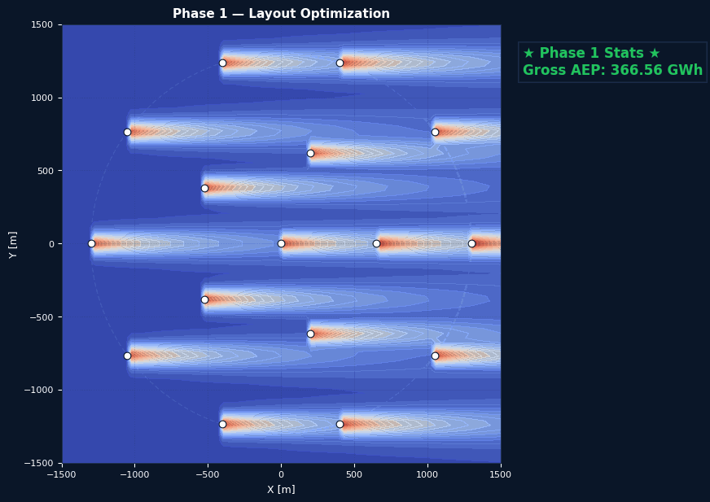
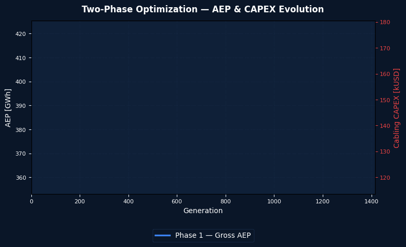
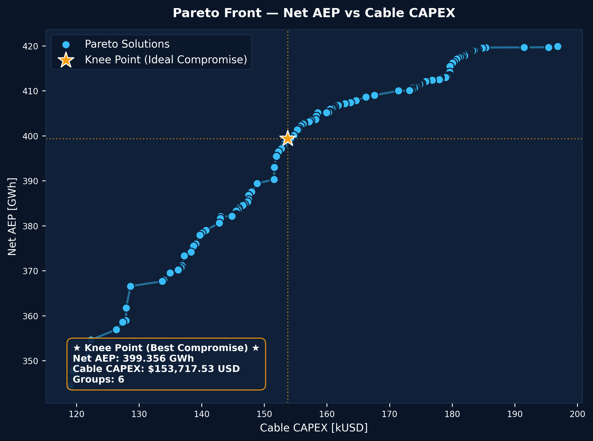
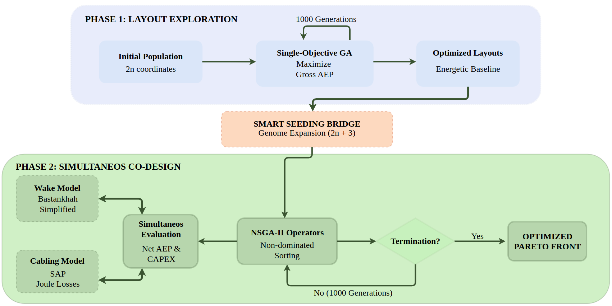

<div align="center">

# Wind Farm Simulator

**Multi-Objective Genetic Algorithm Optimization of Offshore Wind Farm Layout, Substation Placement, and Cable Grouping**

*Presented at [GECCO 2026](https://gecco-2026.sigevo.org/) · San José, Costa Rica*

[](https://python.org)
[](https://github.com/DEAP/deap)
[](LICENSE)
[](https://gecco-2026.sigevo.org/)

</div>

---

## Overview

Traditional offshore wind farm design treats **layout optimization** and **cable routing** as separate problems.  
This repository presents a **Two-Phase Hierarchical Framework** that jointly optimizes:

| Objective | Description |
|---|---|
| **Net AEP** (↑ maximize) | Annual Energy Production minus Joule cable losses |
| **Cabling CAPEX** (↓ minimize) | Inter-array cable investment (NREL cost model) |

The key contributions are:

- **Two-Phase Genome Expansion** — Phase 1 optimizes turbine positions; Phase 2 expands the genome to jointly co-design substation placement and cable grouping.
- **Strict Angular Partitioning (SAP)** — Guarantees 100% planar, non-crossing cable networks in O(N log N) time, without MILP solvers.
- **Integrated Cost Model** — SAP's sector-bounded topology enables direct analytical computation of cable lengths per group, making cabling CAPEX a tractable optimisation objective.

---

## Optimization & Results Visualizations

The optimization co-design process discovers a set of Pareto-optimal trade-offs. Below is the visualization of the layout and AEP evolution leading to the selection of the **Knee Point** solution (representing the best compromise between cabling CAPEX and net AEP), alongside the final **Pareto Front**:

<div align="center">

| Layout Evolution (Knee Point Trajectory) | AEP Evolution & Phase Transition (Knee Point Trajectory) |
|:---:|:---:|
|  |  |
| Turbines spread to reduce wake losses, then cables & substation are routed in Phase 2 toward the Knee Point. | Net AEP dips when cabling losses are introduced, then recovers via co-design toward the Knee Point. |

### Final Pareto Front (Knee Point)



*The co-design optimization discovers a set of Pareto-optimal layouts. The gold star marks the Knee Point, representing the best compromise between cabling CAPEX and net AEP.*

</div>

> **Generate these figures yourself:** `python simulate.py`

---

## Quick Start

### 1. Clone & install

```bash
git clone https://github.com/ITA-LOW/wind_farm_simulator.git
cd wind_farm_simulator
pip install -r requirements.txt
```

### 2. Run the end-to-end case
    
```bash
python simulate.py
```

This runs the optimization on the default case config (`cases/case_example.yaml`) and produces the following files inside `results/user_run/`:

```
results/user_run/
├── aep_evolution.png        # Trajectory of AEP/CAPEX metrics
├── pareto_front.png         # Final Pareto front (AEP vs CAPEX)
├── knee_layout.png          # Optimal layout of turbines and cables at the Knee Point
├── evolution_layout.gif     # Layout and cabling optimization evolution animation
└── aep_evolution.gif        # AEP and CAPEX metrics convergence animation
```

---

## Running Custom Simulations

You can run your own custom co-design optimization by configuring a YAML file inside the `cases/` directory and executing the interactive `simulate.py` runner. 

The optimizer will automatically run:
1. **Phase 1 (Layout-only)**: Optimizes turbine locations for maximum AEP. Stops automatically when a performance plateau is detected (no improvement at all over 50 generations, up to a limit of 1000 generations).
2. **Phase 2 (Co-design)**: Expands the genome to optimize turbine locations, substation position, and cable grouping. Stops when the objectives on the Pareto front converge.
3. **Visualization & Plotting**: Generates real evolution GIFs (`phase1_evolution.gif` and `phase2_cabling.gif`) and a static `aep_evolution.png` plot showing the exact AEP trajectory and phase transition.

### Running custom configurations:
1. Create a custom configuration file, e.g., `cases/my_case.yaml` (see [cases/README.md](file:/gecco_demo/cases/README.md) for details).
2. Run your simulation:
```bash
python simulate.py --case cases/my_case.yaml --output results/my_results
```
---

## Framework Architecture



---
## Repository Structure

```
opt_wind_farm_simulator/
│
├── cases/                  # Custom simulation cases (YAML files)
│   ├── case_example.yaml   # Default case
│   └── README.md           # Instructions on how to build custom cases
│
├── config/                 # Benchmark data & AEP calculator
│   ├── iea37_aepcalc.py    # Bastankhah Gaussian wake + AEP
│   ├── iea37-ex16.yaml     # 16-turbine benchmark layout
│   ├── iea37-335mw.yaml    # Turbine power curve & attributes
│   └── iea37-windrose.yaml # 16-bin wind rose
│
├── core/                   # Physics & optimization engine
│   ├── wfwe.py             # WindFarm class (Bastankhah wake + visualization)
│   ├── cabling_v3.py       # SAP algorithm + cable electrical model + CAPEX
│   └── plot.py             # Publication-quality plotting utilities
│
├── optimizer/              # NSGA-II multi-objective optimizer & benchmarks
│   └── benchmark.py        # GECCO benchmark comparison script
│
├── simulate.py             # Interactive custom simulation CLI
└── results/                # Output directory
```

---

## Citing This Work

If you use this code, please cite:

```bibtex
@inproceedings{Silva2026WFS,
  author    = {Italo Firmino da Silva and Guilherme Trajano and
               Telles B. Lazzarin and Lenon Schmitz and
               Tamiris Grossl Bade and Wilian Comin and Alison R. Panisson},
  title     = {Multi-objective Genetic Algorithm Optimization of Offshore
               Wind Farm Layout, Substation Placement, and Cable Grouping},
  booktitle = {Proceedings of the Genetic and Evolutionary Computation
               Conference (GECCO 2026)},
  year      = {2026},
}
```
---

## Acknowledgements

This work was partially supported by **CNPq** and **FNDCT** (MCTI, Brazil), Process 407826/2022-0.

<div align="center">
<sub>Federal University of Santa Catarina · LAIA · INEP · LIA</sub>
</div>
